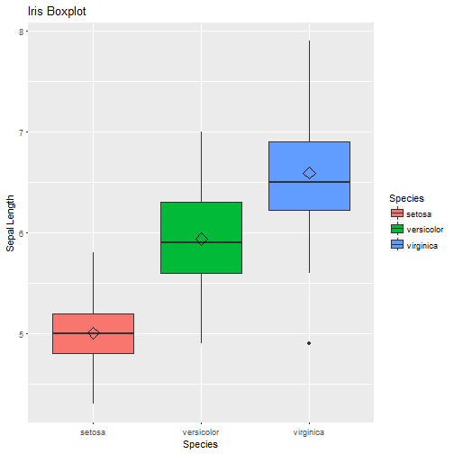

## Slide 1


```r
library(tables, quietly = TRUE)
```

```
## 
## Attaching package: 'Hmisc'
```

```
## The following objects are masked from 'package:base':
## 
##     format.pval, round.POSIXt, trunc.POSIXt, units
```

```r
library(pander)
tab <- tabular( (Species + 1) ~ (n=1) + Format(digits=2)*
         (Sepal.Length + Sepal.Width)*(mean + sd), data=iris )
pander(tab)
```


-------------------------------------------------------------------
      \         \     Sepal.Length\     \     Sepal.Width\     \   
   Species       n         mean         sd        mean         sd  
-------------- ----- ---------------- ------ --------------- ------
   *setosa*     50         5.01        0.35       3.43        0.38 

 *versicolor*   50         5.94        0.52       2.77        0.31 

 *virginica*    50         6.59        0.64       2.97        0.32 

    *All*       150        5.84        0.83       3.06        0.44 
-------------------------------------------------------------------

## Slide 2


```r
library(ggplot2)
box <- ggplot(data=iris, aes(x=Species, y=Sepal.Length))
box + geom_boxplot(aes(fill=Species)) + 
  ylab("Sepal Length") + ggtitle("Iris Boxplot") +
  stat_summary(fun.y=mean, geom="point", shape=5, size=4) 
```



## Slide 3


