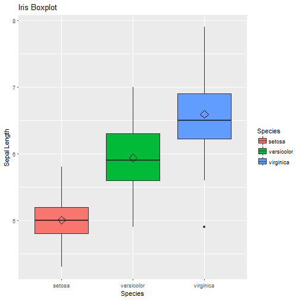

## Slide 1

<table>
<caption>Base iris</caption>
 <thead>
  <tr>
   <th style="text-align:right;"> Sepal.Length </th>
   <th style="text-align:right;"> Sepal.Width </th>
   <th style="text-align:right;"> Petal.Length </th>
   <th style="text-align:right;"> Petal.Width </th>
   <th style="text-align:left;"> Species </th>
  </tr>
 </thead>
<tbody>
  <tr>
   <td style="text-align:right;"> 5.1 </td>
   <td style="text-align:right;"> 3.5 </td>
   <td style="text-align:right;"> 1.4 </td>
   <td style="text-align:right;"> 0.2 </td>
   <td style="text-align:left;"> setosa </td>
  </tr>
  <tr>
   <td style="text-align:right;"> 4.9 </td>
   <td style="text-align:right;"> 3.0 </td>
   <td style="text-align:right;"> 1.4 </td>
   <td style="text-align:right;"> 0.2 </td>
   <td style="text-align:left;"> setosa </td>
  </tr>
  <tr>
   <td style="text-align:right;"> 4.7 </td>
   <td style="text-align:right;"> 3.2 </td>
   <td style="text-align:right;"> 1.3 </td>
   <td style="text-align:right;"> 0.2 </td>
   <td style="text-align:left;"> setosa </td>
  </tr>
  <tr>
   <td style="text-align:right;"> 4.6 </td>
   <td style="text-align:right;"> 3.1 </td>
   <td style="text-align:right;"> 1.5 </td>
   <td style="text-align:right;"> 0.2 </td>
   <td style="text-align:left;"> setosa </td>
  </tr>
  <tr>
   <td style="text-align:right;"> 5.0 </td>
   <td style="text-align:right;"> 3.6 </td>
   <td style="text-align:right;"> 1.4 </td>
   <td style="text-align:right;"> 0.2 </td>
   <td style="text-align:left;"> setosa </td>
  </tr>
  <tr>
   <td style="text-align:right;"> 5.4 </td>
   <td style="text-align:right;"> 3.9 </td>
   <td style="text-align:right;"> 1.7 </td>
   <td style="text-align:right;"> 0.4 </td>
   <td style="text-align:left;"> setosa </td>
  </tr>
</tbody>
</table>
--
## Slide 2


--

## Slide 3


--
## Slide 4

```r
library(knitr)
kable(head(iris), "html", caption = "Base iris")
library(ggplot2)
box <- ggplot(data=iris, aes(x=Species, y=Sepal.Length))
box + geom_boxplot(aes(fill=Species)) + 
  ylab("Sepal Length") + ggtitle("Iris Boxplot") +
  stat_summary(fun.y=mean, geom="point", shape=5, size=4) 
```
